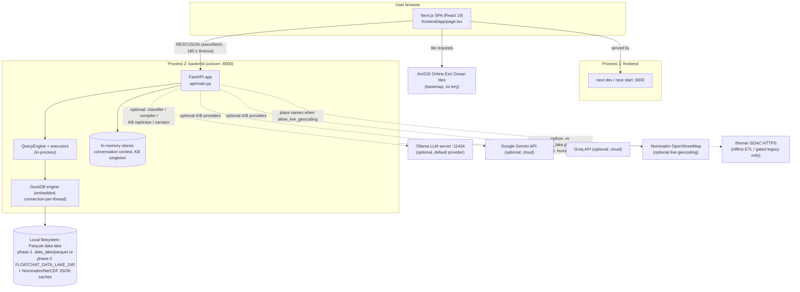
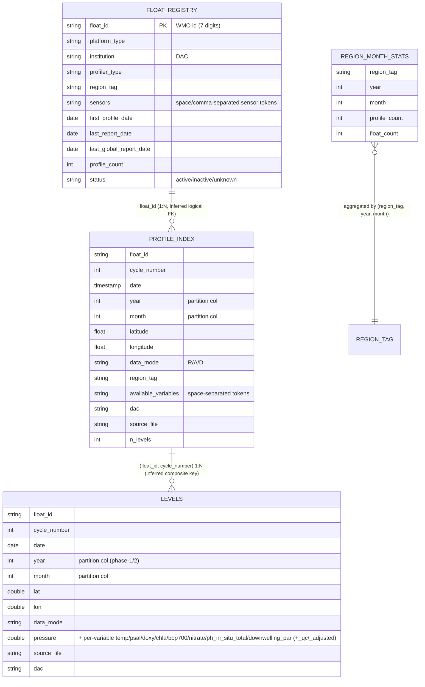
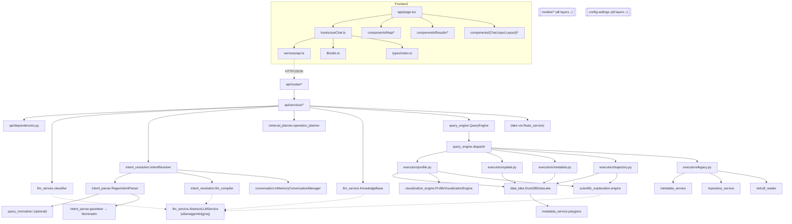

# FloatChat Architecture Context

> **Purpose:** self-contained technical context for an AI architect who cannot access this repository.
> Produced by a read-only architecture-discovery audit on 2026-07-26 against git `HEAD = 56e8c74` (branch `main`, clean worktree).
> Rule compliance: no application code was modified, no dependencies installed/upgraded/removed, no commits made, no secret values exposed.
> Inferences are marked **[INFERRED]**; unverifiable items are collected in §21/§22.

---

## 1. Executive Summary

- **What FloatChat does:** converts natural-language questions about Argo ocean-float measurements (temperature, salinity, oxygen, chlorophyll, nitrate, pH, …) into validated answers with interactive Plotly figures and map markers. All data answers come from a **local DuckDB/Parquet data lake** built offline from the official Ifremer GDAC; live GDAC downloads are disabled for chat traffic by default (`FLOATCHAT_ALLOW_REMOTE_GDAC_FALLBACK=False`).
- **Primary users/use cases:** oceanographers/INCOIS operators exploring Indian-region Argo data: profile plots, regional searches, float metadata, trajectories, comparisons, counts, nearest-float discovery, plus an exploratory float dashboard (registry map → per-float drill-down).
- **Current architecture style:** **layered modular monolith** (two deployables: FastAPI backend + Next.js frontend) with a *deterministic-core / bounded-LLM-edge* philosophy. The architecture is deliberately **frozen** by cleanup Milestones M1–M5 (`/ARCHITECTURE.md`, `floatchat/docs/cleanup/M1..M5`), and hardened by Bug Fix Sprint 1.
- **Main applications/services:** `floatchat/` (Python ≥3.11 FastAPI backend, `pip install -e`, uvicorn) and `frontend/` (Next.js 15 SPA). Auxiliary offline ETL CLIs live inside the backend package (`data_lake/phase2_builder.py`, `data_lake/ingest.py`, `floatchat/scripts/*`).
- **Overall maturity:** pre-production/demo-grade but unusually well-hygiened: 715 hermetic tests, an authoritative architecture contract, deterministic pipeline reproducibility, and a full milestone-history. Notable gaps: **no authentication, no rate limiting, no production deployment artifacts (no Dockerfile/CI), process-local state only, no frontend tests.**
- **End-to-end in one paragraph:** Browser SPA posts `{message, session_id}` to `POST /api/v1/chat` → rule-first 4-way classifier (LLM only as tie-break) → canonical `IntentResolver` (deterministic `RegexIntentParser` → fill-only LLM compiler fallback → validation → conversation-context enrichment) → pure `plan_from_intent` (mixed-query gate) → `QueryEngine.execute` → intent-family executor → DuckDB SQL over Parquet → pandas DataFrame → Plotly figure + guarded scientific explanation → `ChatResponse{message, figure(s), map_data, data_summary}` rendered by the SPA (map, chat, plot drawer).

---

## 2. Repository Overview

- **Repository type:** two-application repo (backend + frontend in one git repo; **not** a package monorepo — no workspace tooling; the backend is one installable Python package).
- **Organization:** first-party code in `floatchat/` (backend) and `frontend/` (web). `[VERIFIED by /home/user/floatchat-2]` listing.
- **Important root-level files:**
  - `/ARCHITECTURE.md` — **authoritative frozen architecture contract** (post-M5).
  - `/pytest.ini` — makes `pytest` from repo root behave identically to `floatchat/` (testpaths + pythonpath).
  - `/.gitignore` — ignores `.env`, data lakes, caches, node_modules; whitelists `floatchat/.env.example`.
  - `floatchat/README.md`, `frontend/README.md` — setup guides consistent with implementation.
  - `floatchat/pyproject.toml`, `floatchat/.env.example`, `frontend/package.json`, `frontend/package-lock.json`, `frontend/next.config.js`, `frontend/tailwind.config.ts`, `frontend/.eslintrc.json`.
- **Git status:** branch `main`, clean worktree at audit time; recent history is exclusively the M1–M5 cleanup chain + Bug Fix Sprint 1 (commits `4608de9 … 56e8c74`). No uncommitted changes existed to preserve. The only untracked artifact created by this audit is this report.
- **Directory tree (generated/third-party excluded):**

```
floatchat-2/
├── ARCHITECTURE.md                 # frozen contract
├── pytest.ini
├── floatchat/                      # BACKEND (installable Python package)
│   ├── README.md  ARCHITECTURE.md(copy of contract)  .env.example  pyproject.toml
│   ├── src/floatchat/              # 20 application subpackages (§5)
│   ├── tests/                      # 715 tests + fixtures/lake_parquet (5.3 MB committed sample lake)
│   ├── scripts/                    # operator CLIs: check_duckdb, check_schema,
│   │                               #   package.py, rebuild_float_registry.py, step1_estimate.py
│   └── docs/                       # cleanup/(M1–M5, Sprint1), architecture/, investigations/, scientific/
└── frontend/                       # WEB (Next.js 15 SPA)
    ├── app/        (layout.tsx, page.tsx, globals.css — single route)
    ├── components/ (Chat/ Input/ Layout/ Map/ Results/)
    ├── hooks/      (useChat.ts — 1236-line controller hook)
    ├── services/   (api.ts REST client)
    ├── lib/        (utils.ts helpers + filter engine)
    └── types/      (index.ts — manual TS mirror of backend contract)
```

---

## 3. Technology Stack

| Layer/category | Technology/library | Version | Purpose | Evidence |
|---|---|---|---|---|
| Language (backend) | Python | ≥3.11 (project code runs on 3.13) | Backend | `floatchat/pyproject.toml` (`requires-python = ">=3.11"`) |
| Backend framework | FastAPI + Uvicorn | fastapi ≥0.110, uvicorn[standard] ≥0.29 | HTTP API, ASGI server | `pyproject.toml` deps; `api/main.py` |
| Backend validation/settings | Pydantic v2, pydantic-settings | ≥2.6 / ≥2.2 | Schemas, env config | `api/schemas.py`, `models/*`, `config.py` |
| Data query engine (DB) | DuckDB + PyArrow | duckdb ≥1.0, pyarrow ≥15 | In-process SQL over Parquet | `data_lake/duckdb_lake.py` |
| Tabular compute | pandas + NumPy | ≥2.2 / ≥1.26 | DataFrame pipeline | executors, viz (`pyproject.toml`) |
| Viz generation | Plotly (Python) | ≥5.19 | Plotly-JSON figures | `visualization_engine/profile.py` |
| Source data format | netCDF4 | ≥1.6.5 | GDAC NetCDF parsing (ETL/legacy) | `netcdf_reader/bgc_reader.py` |
| HTTP client | httpx | ≥0.27 | GDAC/Nominatim/LLM providers | `repository_service/gdac_http.py`, `llm_service/*` |
| Misc runtime | tqdm ≥4.66, python-dateutil, rapidfuzz ≥3.0, pytz ≥2024.1 | see manifest | ETL progress; datetime; fuzzy normalization; duckdb TIMESTAMPTZ | `pyproject.toml` (pytz added by Sprint 1) |
| LLM providers (optional) | Ollama (local HTTP), Google Gemini, Groq | model defaults: `qwen2.5:3b`, `gemini-2.5-flash`, `openai/gpt-oss-120b` | classifier tie-break, intent compiler, KB rephrase, narrator | `llm_service/{ollama,gemini,groq,factory}.py`, `config.py` |
| Frontend framework | Next.js (App Router) | 15.5.20 | SPA shell | `frontend/package.json`, `app/` |
| UI runtime | React | 19.0.0 | Components | `frontend/package.json` |
| HTTP client (frontend) | axios ^1.7 + fetch (telemetry paths) | 1.7 | REST calls | `frontend/services/api.ts` |
| Realtime/chat technology | **None** — synchronous POST/response | — | No WS/SSE anywhere | verified by grep over `floatchat/src`, `frontend/` |
| State management | React `useState`/`useRef`/`useMemo` only (no Redux/Zustand/query lib) | — | All SPA state | `hooks/useChat.ts` |
| Map | MapLibre GL + react-map-gl | 5.24 / 8.1 | Ocean basemap + markers | `components/Map/MapPanel.tsx` |
| Client viz | plotly.js-dist-min | ^2.35 | Figure rendering | `components/Results/PlotlyChart.tsx` |
| Styling/UI | Tailwind CSS 3.4, clsx, tailwind-merge, Framer Motion 11.18, lucide-react 0.460 | see manifest | Design system, animation, icons | `tailwind.config.ts`, `app/globals.css` |
| Authentication | **None implemented** | — | No login/user model in repo | verified by grep (`jwt|Authorization|password|login`) — only LLM API-key usage matched (`llm_service/groq.py`) |
| Cache | In-process structures + small JSON file caches | — | conversation dict, KB singleton, Nominatim result cache, NetCDF download cache | `conversation/memory.py`, `llm_service/knowledge_base.py`, `intent_parser/gazetteer.py`, `repository_service/gdac_http.py` |
| Queue/event system | **None** | — | — | verified: no celery/rq/broker code/config |
| Testing | pytest + pytest-asyncio | ≥8.1 / ≥0.23 | 715-test hermetic suite | `pyproject.toml [tool.pytest]`, `tests/` |
| Lint/type (backend) | ruff (E,F,I,N,W,UP,B,C4,SIM) | ≥0.3 (dev dep) | lint | `pyproject.toml [tool.ruff]` |
| Lint/type (frontend) | eslint + eslint-config-next, TypeScript | 8.57 / 15.5.20 / ^5.6 | lint + compile-time types | `frontend/.eslintrc.json`, `tsconfig.json` |
| Hosting/deployment infra | **None in repo** (no Dockerfile, no compose, no CI, no IaC) | — | — | verified: no matching files at any depth ≤3 |

---

## 4. Runtime and Deployment Topology

**Verified processes (local development): exactly two.** No database server, cache server, queue, or worker daemon exists; all persistence is files on disk; all caches are process-local. **[INFERRED]** production is intended to mirror local (uvicorn + `next start`) since no deployment manifests exist.



| Concern | Reality |
|---|---|
| Client apps | Single SPA (no mobile app) |
| API/backend processes | One uvicorn process; lifespan-built singletons (`api/dependencies.py::initialize_runtime_services`) |
| WebSocket/realtime processes | **None** |
| Workers/schedulers | **None at runtime.** Offline ETL CLIs are run manually: `python -m floatchat.data_lake.phase2_builder`, `…ingest`, `floatchat/scripts/rebuild_float_registry.py` |
| Database | Embedded DuckDB over Parquet files (no server) |
| Cache | Process-local dicts; JSON file caches (Nominatim, NetCDF) under cache dirs derived from settings |
| Object/file storage | Parquet lake on local disk (`FLOATCHAT_DATA_LAKE_DIR` for phase-2; `.data_lake/parquet` fallback; committed 5.3 MB fixture lake for tests) |
| Third-party integrations | Ollama, Gemini, Groq, Nominatim, GDAC HTTPS, ArcGIS tiles (§13) |
| Deployment platform | **[INFERRED]** currently a single-machine developer deployment; nothing verifiable beyond local runbooks |

---

## 5. Applications, Modules, and Responsibilities

Backend package `floatchat` (`floatchat/src/floatchat/`). Boundary enforcement follows the ARCHITECTURE.md §5 visibility convention: **public API** (QueryEngine, `handle_chat`, `build_*_response`, models) / **package-internal** (`query_engine.dispatch`, `executors.*`, `ExecutionDeps`) / **module-internal** (underscore-prefixed helpers). Enforcement is **conventional, not mechanized** (no import-linter). **[VERIFIED: /ARCHITECTURE.md §5]**

| Module | Responsibility | Key files (size) | Public interface | Depends on | Boundary strength |
|---|---|---|---|---|---|
| `api` | HTTP layer + DI composition root + app factory | `main.py` (176), `routes/{chat,floats,health}.py` (thin), `services/chat_service.py` (681), `services/floats_service.py` (884), `services/health_service.py` (54), `dependencies.py` (357), `schemas.py` (65) | `create_app`, `handle_chat`, `build_*_response` | all pipeline & engine layers | strong (frozen workflow per M3) |
| `llm_service` | Query classifier, LLM abstraction + providers, knowledge base | `classifier.py` (342), `{base,factory,ollama,gemini,groq}.py`, `knowledge_base.py` (242) + `knowledge_base.json` (~20 entries) | `QueryClassifier`, `AbstractLLMService`, `KnowledgeBase` | config, httpx | strong |
| `intent_parser` | Deterministic parsing | `regex.py` (1009), `fuzzy.py`, `gazetteer.py` (328), `seasons.py`, `{base,mock,ollama}.py` (mock/ollama = alternates not wired in prod) | `AbstractIntentParser.parse → ParsedIntent`; `is_available_plots_query` | models, query_normalizer (optional) | strong |
| `intent_resolution` | Canonical resolution pipeline | `resolver.py` (202), `llm_compiler.py` (72) | `IntentResolver.resolve` | intent_parser, conversation, models | strong |
| `query_normalizer` | Optional pre-parse normalization | `fallback.py` (78, RapidFuzz), `ollama.py` (51, unwired by default) | `AbstractQueryNormalizer.normalize` | — | strong |
| `conversation` | Session memory | `memory.py` (363), `reference_phrases.py`, `base.py` | `AbstractConversationManager` (`merge_context`, `update_context`) | models | strong |
| `retrieval_planner` | Query planning | `operation_planner.py` (189, pure; chat path), `planner.py` (RetrievalPlanner; legacy GDAC path only) | `plan_from_intent`, `RetrievalPlanner.plan` | models | strong (advisory to engine) |
| `query_engine` | Execution core (post-M4 decomposition) | `engine.py` (175 orchestrator), `dispatch.py` (97 routing + `ExecutionDeps`), `executors/{profile,spatial,metadata,trajectory,legacy}.py`, `helpers.py`, `response_builder.py` | **`QueryEngine(metadata, repository, reader, viz, explanation_engine=None, data_lake=None)` + `.execute(ParsedIntent) → ChatResponse`** | data_lake, viz, scientific_explanation, legacy services | strong (frozen contract) |
| `data_lake` | Lake access + ETL | `duckdb_lake.py` (1583), `base.py` (`AbstractDataLake`, `LakeQueryCriteria`, `LakeQueryResult`), `phase2_builder.py` (1330 ETL), `ingest.py` (500 phase-1 ETL) | `query`, `get_map_markers`, `get_profile_index`, `get_float_registry`, `query_nearest_float`, `query_radius_search`, `query_metadata_lookup`, `query_count_aggregate`, health probes | pandas, duckdb, metadata_service.polygons | strong |
| `metadata_service` | GDAC index metadata (legacy/ETL) + region polygons | `gdac.py` (`GDACMetadataService`), `polygons.py` (`REGION_POLYGONS`, `point_in_region`), `regions.py` | `AbstractMetadataService` | httpx | strong (runtime-disabled by default) |
| `repository_service` | GDAC NetCDF download + cache (legacy/ETL) | `gdac_http.py` (retries + TTL cache), `base.py`, `dataset_wrapper.py` | `AbstractRepositoryService.fetch` | httpx, netCDF4 | strong |
| `netcdf_reader` | NetCDF → records | `bgc_reader.py`, `base.py` | `AbstractNetCDFReader.read` | netCDF4 | strong |
| `scientific_explanation` | Facts + guarded narration | `features.py` (1101), `engine.py` (637), `schemas.py` (488), `verification_guard.py` (338), `prompt_builder.py`, `output_parser.py`, `narrator.py`, `interpretation.py`, `reasoning.py` | `ScientificExplanationEngine.generate_explanation` | models, llm_service | strong |
| `visualization_engine` | Plotly figures | `profile.py` (~610: grid/comparison/time-series/hovmoller/TS), `base.py` | `AbstractVisualizationEngine.render/render_per_variable` | plotly, pandas | strong |
| `variable_registry` | Canonical variable catalogue | `registry.py` (`VariableRegistry`, `VariableDefinition`) | validation/normalization/classification of variable names | — | strong |
| `models` | Pydantic contracts | `intent.py` (ParsedIntent — frozen), `response.py` (ChatResponse/MapData/ErrorResponse), `metadata.py` (MetadataRecord/SearchCriteria), `conversation.py` (ConversationContext) | contracts used by every layer | — | strong (M5-frozen) |
| `config` / `exceptions` / `logging_config` | cross-cutting | `config.py` (163, pydantic-settings), `exceptions.py` (FloatChatError family), `logging_config.py` | `settings` singleton | — | strong |

**Cross-cutting/shared utilities:** `query_engine/helpers.py` (figure metrics, manufacturer map, alive-window, marker enrichment — Sprint 1), `response_builder.py` (payload construction). **Duplicated responsibilities (verified):** ocean/variable/region vocabularies exist in ≥5 places (`llm_service/classifier.py` `_OCEAN_RELEVANT_REGEX`, `intent_parser/regex.py` `_VAR_PATTERNS` + region synonyms, `retrieval_planner/operation_planner.py` `_KNOWLEDGE_CONCEPTS`, `llm_service/knowledge_base.json` keywords, `visualization_engine/profile.py` `_VAR_TITLES`); two planner implementations coexist **by design** (ARCHITECTURE.md §3); three intent-parser implementations exist (`regex/mock/ollama`) with only `regex` wired in production.

**Frontend modules:** single Next.js app. `app/page.tsx` (429) is the only route — the workspace orchestrator. `hooks/useChat.ts` (1236) is the controller hook (messages, session, map layers, filters, plot drawer, float focus, cycle history). `services/api.ts` (240) REST client (axios + instrumented fetch; 180 s timeouts). `lib/utils.ts` (126) formatting + `applyFilters` filter engine. `types/index.ts` (216) **manual TS mirror** of backend contracts (`MapData`, `ChatResponse`, …). Components grouped by role: `Chat/` (panel, history, message, typing indicator), `Input/PromptInput`, `Layout/` (Header, MainLayout, Sidebar filter rail), `Map/` (MapPanel maplibre + Esri basemap, CycleHistory), `Results/` (PlotDrawer, PlotlyChart, MetadataInspector, FloatMetadataCard, FloatDetailCard, CountStatCard, ResultsPanel, SummaryCards).

---

## 6. Startup and Execution Flow

- **Local dev (backend):**
  ```bash
  cd floatchat && pip install -e ".[dev]"        # README §Quick Start (py3.11+)
  uvicorn floatchat.api.main:app                 # default :8000 (frontend README assumes 127.0.0.1:8000)
  ```
- **Local dev (frontend):**
  ```bash
  cd frontend && npm install && npm run dev      # next dev -p 3000
  ```
- **Production start:** no production scripts/configs in repo. **[INFERRED]** `uvicorn floatchat.api.main:app --host 0.0.0.0` + `npm run build && npm start` (package.json `build`/`start` scripts exist).
- **Bootstrap sequence (`api/main.py::lifespan`, verified):** `configure_logging()` → `cleanup_expired_netcdf_cache()` → *(only if* `enable_gdac_runtime=True`*)* GDAC index load → `initialize_runtime_services()` → `yield`. **Shutdown: nothing explicit** (comment "Shutdown: nothing to clean up explicitly"); DuckDB connection teardown relies on process exit. **[INFERRED]** abrupt kill is safe because reads are stateless and the lake is read-mostly.
- **Configuration loading:** `floatchat/config.py` pydantic-settings, `FLOATCHAT_` prefix, optional `.env` at process cwd (template: `floatchat/.env.example`); single `settings` singleton.
- **Dependency initialization:** `api/dependencies.py` — lazily-built cached singletons: metadata service, **data lake** (`get_data_lake`; phase-2 dir if configured+populated else phase-1 root), repository, reader, visualization engine, normalizer (mode-dependent), intent parser (`RegexIntentParser`), scientific LLM/narrator/explanation engine, `QueryEngine`, classifier, conversation manager, `IntentResolver`, knowledge base. `initialize_runtime_services()` eagerly builds the runtime graph at startup (data lake owns thread-affine DuckDB connections, created on first use per worker thread — `duckdb_lake.py` `_thread_connections`).
- **Database connection initialization:** embedded; `DuckDBDataLake._get_connection()` (thread-local). Phase-2 root re-points `_lake_root` to `parquet/levels` (`duckdb_lake.py::__init__`).
- **Realtime server init:** N/A (none).
- **Worker init:** N/A (no background workers; manual ETL only).

---

## 7. Core User and Data Flows

**Important scope note (verified):** FloatChat has **no user accounts, no login/registration, no persisted conversations, no realtime delivery, no contacts/groups, no uploads, no notifications.** Chat history lives only in React state; the backend's "conversation" is a last-turn intent summary keyed by a client-generated opaque `session_id`.

### 7.1 "Session" bootstrap (closest analog to login)

```mermaid
sequenceDiagram
    participant U as User (browser)
    participant FE as useChat.ts
    participant BE as FastAPI backend
    U->>FE: open app
    FE->>FE: sessionIdRef = generateId()<br/>(timestamp+random; lib/utils.ts:9)<br/>NOT persisted (no localStorage)
    FE->>BE: GET /api/v1/floats/registry
    BE->>BE: floats_service.build_float_registry_response()<br/>→ lake.get_float_registry()/get_map_markers
    BE-->>FE: {float_count, map_data[], networks[], dacs[], variables[], statuses[]}
    FE->>U: render map + sidebar filter options
    Note over FE,BE: No auth handshake exists; /health is unauthenticated<br/>and used by the SPA for status display.
```

### 7.2 Sending a message (primary flow)

```mermaid
sequenceDiagram
    participant U as User
    participant FE as useChat.sendMessage
    participant API as routes/chat.py
    participant SVC as chat_service.handle_chat
    participant CLS as QueryClassifier
    participant RSL as IntentResolver
    participant PLN as plan_from_intent
    participant QE as QueryEngine/Executor
    participant DB as DuckDB/Parquet lake
    participant VIZ as VisualizationEngine
    participant SCI as ScientificExplanationEngine
    U->>FE: type + Enter
    FE->>FE: append user message, isLoading=true
    FE->>API: POST /api/v1/chat {message, session_id}
    API->>SVC: handle_chat(request, DI singletons)
    SVC->>CLS: classify (rules first; LLM tie-break; context override)
    alt SMALL_TALK / OUT_OF_DOMAIN
        CLS-->>SVC: label → SVC returns hardcoded text
    else KNOWLEDGE_QUERY
        SVC->>SVC: KnowledgeBase.get_best_match (TF-IDF 0.7 + keywords 0.3)<br/>→ strict LLM rephrase or raw entry
    else DATA_QUERY
        SVC->>RSL: resolve(message, session_id)
        RSL->>RSL: RegexIntentParser.parse → (LLMIntentCompiler fill-only fallback) → validate → context enrichment (merge_context)
        SVC->>PLN: plan_from_intent (pure; no I/O)
        alt mixed plan (knowledge+data)
            SVC->>SVC: _execute_mixed_plan (KB text + engine response merged)
        else critical fields missing
            SVC-->>FE: clarification question (HTTP 200)
        else available-plots interception (Sprint 1)
            SVC-->>FE: intent="available_plots" (deterministic listing; engine NOT invoked)
        else
            SVC->>QE: execute(ParsedIntent)
            QE->>DB: executor SQL (parameterized)
            DB-->>QE: pandas DataFrame + aggregates
            QE->>VIZ: render(intent, df) [figure intents]
            QE->>SCI: generate_explanation (facts → optional LLM → verification guard → fallback)
            QE-->>SVC: ChatResponse{intent,message,figure(s),map_data,data_summary}
        end
    end
    SVC->>SVC: conversation_manager.update_context(session, intent, response)
    SVC-->>FE: 200 ChatResponse (logical errors also arrive as 200 with intent="error")
    FE->>FE: append assistant message; set queryMapData/focus mode;<br/>apply filters → MapPanel; build PlotItem(s) → PlotDrawer
```

**Trigger → backend handler → storage → response summary:** POST `/api/v1/chat` → `routes/chat.py::chat` → `chat_service.handle_chat` → DuckDB SQL via `DuckDBDataLake` → JSON `ChatResponse`. **Error handling (verified):** domain exceptions mapped to HTTP codes in `main.py` (`IntentParseError→400, MetadataError→503, RepositoryError→502, NetCDFReadError/VisualizationError→500`), catch-all `Exception→500` with traceback hidden; `handle_chat` additionally converts internal failures into `ChatResponse(intent="error", HTTP 200)`; frontend `getErrorMessage` surfaces axios/network/timeout errors (180 s, `services/api.ts`).

### 7.3 Float drill-down flow (deterministic, no LLM)

Click marker in `MapPanel` → `useChat` focus mode → parallel REST calls `GET /floats/{id}/metadata`, `/trajectory`, `/available-plots` → optional buttons `GET /floats/{id}/latest-profile`, `GET /floats/{id}/plot?variable=X&profile_number=N` → panels: MetadataInspector, CycleHistory, pinned PlotDrawer items. All served by `floats_service.build_*_response` (deterministic; narrator forced off for plots).

### 7.4 Flows that do not exist (verified absence)

Registration/login/session validation; opening a server-stored conversation; realtime message delivery; message persistence/retrieval; contacts/groups; file/media upload; notifications; presence/typing/read receipts (the TypingIndicator component is purely local UI while awaiting the POST response).

---

## 8. Frontend Architecture

- **Route/page structure:** single route `app/page.tsx` (+ `app/layout.tsx` metadata shell; `app/globals.css` Tailwind). `MapPanel` loaded with `next/dynamic(ssr:false)`. **All pages are client components** (`"use client"`).
- **Component organization:** role-grouped (`Chat/`, `Input/`, `Layout/`, `Map/`, `Results/`) with one page orchestrating ~60 values from `useChat`.
- **State management:** plain React state/refs — no external store, no server-state library. Server data cached only in component state per page load (registry, float metadata, cycles, plots). No `localStorage`/`sessionStorage` anywhere (verified by grep).
- **API client:** `services/api.ts` — axios instance (`baseURL = NEXT_PUBLIC_BACKEND_URL || http://127.0.0.1:8000`, 180 s timeout) plus two raw-`fetch` instrumented paths that split network vs `JSON.parse` timing (`sendChatMessage`, `getFloatVariablePlot`).
- **Realtime connection lifecycle:** none.
- **Auth/session handling:** none; `sessionIdRef = generateId()` (lib/utils.ts — `Date.now()+random`) regenerated per page load; sent as `session_id` on every chat POST.
- **Data fetching/caching:** direct calls inside the hook (`getInitialRegistry`, `getFloatMetadata`, `getFloatTrajectory`, `getFloatAvailablePlots`, `getFloatLatestProfile`, `getFloatVariablePlot`); stale-response guards via request-counter refs (e.g. `availablePlotsReqRef`).
- **Form validation:** none beyond non-empty input; backend enforces `ChatRequest.message min_length=1` and `VariableRegistry.is_valid_variable` (422).
- **Error/loading states:** `isLoading` (chat), `isLoadingMetadata`, `isLoadingCycles`, `isLoadingAvailablePlots`, TypingIndicator, `getErrorMessage` toasts-as-messages.
- **Styling/design system:** Tailwind utilities + custom CSS (160-line globals.css), Framer Motion animations, lucide icons, oceanic dark theme.
- **Key shared components:** `MapPanel` (707 lines: maplibre layers, markers sized by `profile_count`, radius rings, trajectory polylines enhanced per Sprint 1 marker fields), `Sidebar` (filters: network/DAC/status/variable/region/date), `PlotDrawer` (793: pinned multi-plot drawer, PNG export), `MetadataInspector` (559: per-float explorer), `CycleHistory` (322).
- **Notable coupling/state issues (verified):**
  1. **`useChat.ts` is a 1236-line god-hook** — 60+ returned values, all cross-concern (chat, map, filters, drawe, float explorer) — the known frontend hotspot.
  2. **Manual contract duplication:** `types/index.ts` mirrors backend Pydantic models by hand; drift risk (Sprint 1 added `region_tag/network/wmo_id` on both sides).
  3. **Filter semantics live client-side** (`lib/utils.ts::applyFilters`) — markers lacking `region_tag` are dropped under an active region filter (this is why Sprint 1 Bug 5 manifested as an empty map).
  4. Mixed axios/fetch client strategies (two telemetry paths).

---

## 9. Backend/API Architecture

- **Server/framework setup:** `api/main.py::create_app()` — FastAPI(title/version 0.1.0, lifespan), `ResponseTimingMiddleware` (custom ASGI bytes/timing logger), `CORSMiddleware`, domain exception handlers, catch-all handler, routers at `/api/v1` + root `/health`. Entrypoint `floatchat.api.main:app`.
- **Route registration:** `api/routes/__init__.py` aggregates `chat.py` + `floats.py`; `health.py` included separately in `main.py`.
- **Controllers/handlers:** thin routers only (M3) — all logic in services (`handle_chat`, `floats_service.build_*`).
- **Service/domain layer:** `api/services/*` orchestration; domain logic in `query_engine/executors/*`, `data_lake/`, `scientific_explanation/`.
- **Repository/data-access:** `data_lake/duckdb_lake.py` (primary), `repository_service/gdac_http.py` + `metadata_service/gdac.py` + `netcdf_reader/bgc_reader.py` (gated legacy).
- **Middleware/interceptors:** timing middleware + CORS only. **No auth, no rate-limit, no security-header middleware.**
- **Validation:** pydantic at HTTP edge (`ChatRequest.message min_length=1`; `profile_number Query(ge=1)`); `VariableRegistry.is_valid_variable` → HTTP 422; internal `ParsedIntent` re-validation in resolver.
- **Error handling:** §7.2 (HTTP-mapped domain errors + 200-carried `intent="error"`).
- **Serialization:** pydantic `response_model` everywhere; Plotly figures are plain dict JSON (`figure.data/layout`).
- **Rate limiting:** **none (verified).**
- **API versioning:** path prefix `/api/v1` (OpenAPI also serves 8 total paths).
- **Realtime event handlers:** none.
- **Dependency injection:** FastAPI `Depends` over composition-root factories in `api/dependencies.py`; engine collaborators via constructor DI (`QueryEngine(metadata, repository, reader, viz, explanation_engine=None, data_lake=None)`); executors via `ExecutionDeps` dataclass.

### Endpoint inventory (complete — 8 endpoints)

| Method | Path | Purpose | Auth required | Input | Output | Handler |
|---|---|---|---|---|---|---|
| POST | `/api/v1/chat` | NL query → answer/figure/map | None | `ChatRequest{message:str≥1, session_id?:str}` | `ChatResponse{intent,message,figure?,figures?,data_summary,map_data[MapData]}` | `routes/chat.py::chat` → `chat_service.handle_chat` |
| GET | `/api/v1/floats/registry` | dashboard bootstrap (all floats, no LIMIT; sidebar option lists) | None | — | `FloatRegistryResponse` | `routes/floats.py::get_float_registry_endpoint` |
| GET | `/api/v1/floats/{float_id}/metadata` | deterministic float metadata card | None | path float_id | `FloatMetadataAPIResponse` | `floats_service.build_float_metadata_response` |
| GET | `/api/v1/floats/{float_id}/trajectory` | full cycle history + trajectory (cap 50 000) | None | path float_id | `FloatTrajectoryAPIResponse` | `build_float_trajectory_response` |
| GET | `/api/v1/floats/{float_id}/latest-profile` | latest profile plot (narrator off) | None | path float_id | `FloatProfileAPIResponse` | `build_latest_profile_response` |
| GET | `/api/v1/floats/{float_id}/available-plots` | variables with data (plots>0) | None | path float_id | `FloatAvailablePlotsResponse{plots:[{variable,title,profiles}]}` | `build_available_plots_response` |
| GET | `/api/v1/floats/{float_id}/plot` | deterministic single-variable plot | None | path float_id; `variable` (validated, default TEMP), `profile_number?≥1` | `FloatProfileAPIResponse` | `build_float_plot_response` |
| GET | `/health` | readiness `{status, duckdb_ready, float_registry_ready, profile_index_ready, levels_ready, gdac_runtime_enabled}` — `degraded` when lake missing | None | — | JSON dict | `routes/health.py` → `health_service.build_health_payload` |

`ChatResponse.intent` is an **open string** (Literal-bound only on `ParsedIntent`): data intents (`profile_plot, region_search, time_series, hovmoller, ts_diagram, comparison(_plot), trajectory, nearest_float, radius_search, metadata_lookup, count_aggregate`) plus UI-level labels (`small_talk, out_of_domain, knowledge_base, clarification, available_plots, error, unknown`).

---

## 10. Domain Model and Persistence

**Database technology:** embedded **DuckDB** querying **Parquet** (hive-partitioned). No ORM, no server, no SQL migrations — the lake is rebuilt by ETL (`data_lake/phase2_builder.py`, `data_lake/ingest.py`), not migrated. Two lake layouts: **phase-1** (single partitioned levels tree at `FLOATCHAT_DATA_LAKE_ROOT`, default `.data_lake/parquet`) and **phase-2** (four tables at `FLOATCHAT_DATA_LAKE_DIR/parquet/…`; preferred when enabled + populated).



- **Schema/model files:** table construction in `data_lake/phase2_builder.py` (lines ~160–440, ~1070–1090); runtime queries in `data_lake/duckdb_lake.py`; domain models in `models/{intent,response,metadata,conversation}.py`; region classification via `metadata_service/polygons.py::point_in_region`.
- **Migration strategy:** none — **rebuild-by-ETL**; parquet schemas are additive-tolerant in readers (e.g., Sprint-1 schema guard probes `region_month_stats` columns before use).
- **IDs/key generation:** float identity = 7-digit WMO id from filename/index; profile identity = `(float_id, cycle_number)`; no surrogate keys; conversation context keyed by client `session_id` (in-memory only).
- **Transactions:** none (read-only workload; ETL writes files).
- **Indexes relevant to performance:** none physical — performance relies on **partition pruning** (`year`/`month` hive partitions) and DuckDB zone-maps/statistics; count fast path uses pre-aggregated `region_month_stats`; nearest/radius use per-float `arg_max(lat, date)` aggregation + haversine (`query_nearest_float`, `query_radius_search`).
- **Soft deletion/retention:** none.
- **Message ordering/pagination:** N/A (no message persistence). Lake queries are limit-capped (`data_lake_max_profiles=100` default; `limit=1` for explicit profile requests; `LIMIT 5000` for map markers).
- **Consistency assumptions:** lake is read-mostly/immutable between ETL runs; in-process DuckDB connections are thread-affine (one per thread); no write contention.
- **Data-access patterns:** `LakeQueryCriteria` → parameterized SQL (`bind ?` params for values; **f-strings only for parquet file paths derived from config**, not user input); per-intent executors call lake methods (`query`, `get_map_markers`, `query_nearest_float`, `query_radius_search`, `query_metadata_lookup`, `query_count_aggregate`, `get_profile_index`, `get_float_registry`).
- **Cache usage:** Nominatim JSON cache (`gazetteer.py`), NetCDF TTL cache (`gdac_http.py::cleanup_expired_netcdf_cache`, TTL days setting), availability cache inside lake (`_availability_cache`), KB singleton, conversation dict.
- **Potential N+1 / hotspots (verified code-level):** `build_available_plots_response` probes per variable per float (`_count_profiles_with_variable` ×8 candidates → multiple DuckDB round-trips per request); phase-1 fallback scans whole partitioned tree per query without region_month_stats; `get_map_markers` runs a second full aggregation query alongside the main data query for region searches (accepted per Sprint 1 design); comparison executes one lake query **per float id** (`executors/profile.py` loop).

---

## 11. Authentication, Authorization, and Security

| Area | Status (all verified in repo) |
|---|---|
| Authentication method | **None.** No user model, login endpoint, token issuance, or session validation exists in backend or frontend. |
| Session/token lifecycle | Only an opaque, client-generated `session_id` (per page load) identifying conversation context; never validated server-side; any client may present any id. |
| Token storage | N/A (no tokens). LLM provider keys live only in backend environment (`GEMINI_API_KEY`/`GROQ_API_KEY` aliases) — **names only; no values inspected**. |
| Password handling | N/A. |
| Authorization rules | None — every endpoint is public. |
| Conversation/message access checks | None; conversation context is keyed, not protected (session-id guessing yields another session's last-turn context **within the same process only**). |
| CORS/CSRF | CORS allowlist `http://localhost:3000`, `http://127.0.0.1:3000`, `allow_credentials=True`, methods/headers `*` (`api/main.py`). CSRF not applicable (no cookies used by API; SPA is same-site dev). |
| Input validation/sanitization | pydantic edge validation; parameterized DuckDB queries for values; variable names whitelisted via `VariableRegistry` (422); float ids path-param strings (no regex constraint). SQL f-strings interpolate only config-derived parquet paths (low injection surface, verified pattern). |
| File upload restrictions | No upload endpoint exists. |
| Secrets/config handling | `.env` git-ignored; `.env.example` template contains names only; settings via pydantic-settings `FLOATCHAT_` prefix + `GEMINI_API_KEY`/`GROQ_API_KEY` aliases; no committed secrets found during audit. |
| Rate limiting/abuse prevention | **None** (no slowapi/middleware present) — risk item R2. |
| Security headers | None set explicitly (no middleware); traceback suppression via catch-all handler (good). |
| Dependency/security concerns | cloud LLM keys optional; `allow_live_geocoding` default **True** — outbound Nominatim calls from the hot path are enabled by default (H.pp note in §18 R6); CORS is dev-localhost only. |

**Declared risks with confidence:** R1 no authN/Z (**verified**, severity high-if-exposed), R2 no rate limiting (**verified**, medium-high), R3 unauthenticated health endpoint exposes internal readiness detail (low), R4 session-context keyed-not-secured (**verified**, low–medium, process-local scope limits impact).

---

## 12. Realtime, Events, and Background Processing

- **WebSocket/SSE/realtime technology:** none (verified by code + dependency search). Chat is single request→response; perceived "typing" is a local spinner.
- **Connection authentication / rooms / channels / events:** N/A.
- **Reconnection/presence/typing/read-receipts:** N/A (TypingIndicator is local UI state only).
- **Message ordering/delivery/dedup/retries:** HTTP-level only; axios timeout 180 s; no client retry logic; backend LLM narrator has its own bounded retry (`sci_narrator_max_retries`, default 0).
- **Horizontal-scaling assumptions:** session memory, KB, and DuckDB connections are **process-local** → multiple API workers would hold disjoint conversation contexts (sticky sessions would be required as-is). **[INFERRED]** for >1 worker; a single worker is the current implicit topology.
- **Queue/broker usage:** none.
- **Background jobs/schedulers:** startup-only: NetCDF cache TTL cleanup in lifespan. Offline ETL is manual (`phase2_builder`, `ingest`, `scripts/rebuild_float_registry.py`, `scripts/check_duckdb.py`, `check_schema.py`, `step1_estimate.py`, `package.py`).
- **Failure/recovery behavior:** LLM seamed failures degrade to deterministic paths (classifier→DATA_QUERY default; compiler→None; narrator→facts/template; KB→raw entry); lake failures → structured zero-result explanations; lake missing → `/health` reports `degraded` and data endpoints return explanatory zero-results rather than crashing.

---

## 13. External Integrations

| Service | Purpose | Calling module/file | Auth (name only) | Sync/async | Failure handling | Required? |
|---|---|---|---|---|---|---|
| Ollama (localhost :11434) | default LLM: classifier, intent compiler, optional normalizer, scientific narrator, KB rephrase | `llm_service/ollama.py`, `factory.py` | none (local) | sync (httpx-style calls via service classes) | timeouts configured per seam; graceful degradation everywhere | **Optional** (`llm_enabled=True` default but every path degrades; default provider per `llm_provider="ollama"`) |
| Google Gemini | A/B cloud LLM provider | `llm_service/gemini.py` | `GEMINI_API_KEY` / `FLOATCHAT_GEMINI_API_KEY` | sync | factory falls back to Ollama if key missing | Optional |
| Groq | A/B cloud LLM provider | `llm_service/groq.py` | `GROQ_API_KEY` / `FLOATCHAT_GROQ_API_KEY` | sync | factory falls back to Ollama | Optional |
| Nominatim (OpenStreetMap) | place-name geocoding for chat spatial queries | `intent_parser/gazetteer.py::_nominatim_geocode` | none (public API) | sync; result JSON file cache | local gazetteer first; unresolved → helpful parse error; can be disabled | Optional (`allow_live_geocoding=True` default — see §18 R6) |
| Ifremer GDAC HTTPS (`data-argo.ifremer.fr`) | NetCDF profile downloads + bio-profile index (ETL, export tools, gated legacy executor) | `repository_service/gdac_http.py` (retries, TTL cache), `metadata_service/gdac.py`, `data_lake/phase2_builder.py`, `ingest.py` | none (public) | sync (retries `http_max_retries`) | retries + cache + runtime-disabled by default (`enable_gdac_runtime`, `allow_remote_gdac_fallback`) | Required only for ETL; **not** for chat runtime |
| ArcGIS Online (Esri World_Ocean_Base) | map basemap tiles | `frontend/components/Map/MapPanel.tsx` (`server.arcgisonline.com`) | none | browser ``/tile fetches | map renders without data layer if tiles fail | Required for map appearance only |

---

## 14. Configuration and Environments

- **Configuration files:** `floatchat/src/floatchat/config.py` (single Settings class, pydantic-settings), `floatchat/.env.example` (documented template), optional `.env` (git-ignored, cwd-resolved), `frontend` uses `process.env.NEXT_PUBLIC_BACKEND_URL` at build/runtime.
- **Supported environments:** no named env framework — behavior is flag-driven; the **test environment** is force-pinned by `tests/conftest.py` (fixture lake, phase-2 disabled) and repo-root `pytest.ini` mirrors `floatchat/pyproject.toml` pytest options.
- **Environment variables (names only; all optional with defaults unless noted):**

| Variable | Purpose (apparent, from `config.py` comments/usage) |
|---|---|
| `FLOATCHAT_DATA_LAKE_DIR` | phase-2 lake root (most important, machine-specific; unset → phase-1 fallback) |
| `FLOATCHAT_DATA_LAKE_ROOT` | phase-1 parquet root (default `.data_lake/parquet`) |
| `FLOATCHAT_DATA_LAKE_ENABLED` | master toggle for DuckDB path (default True) |
| `FLOATCHAT_DATA_LAKE_PHASE2_ENABLED` | prefer phase-2 layout when populated (default True) |
| `FLOATCHAT_DATA_LAKE_MAX_PROFILES` | lake query cap per request (100) |
| `FLOATCHAT_DATA_LAKE_DOWNLOAD_WORKERS` | ETL parallelism (4) |
| `FLOATCHAT_GDAC_BASE_URL`, `FLOATCHAT_METADATA_INDEX_PATH`, `FLOATCHAT_METADATA_CACHE_TTL_HOURS` | GDAC index source + cache |
| `FLOATCHAT_ENABLE_SYNTHETIC_INDEX`, `FLOATCHAT_ENABLE_GDAC_RUNTIME` | GDAC runtime gates (False) |
| `FLOATCHAT_ALLOW_REMOTE_GDAC_FALLBACK` | permits live remote downloads in engine (False; "NOT recommended") |
| `FLOATCHAT_HTTP_TIMEOUT/MAX_RETRIES/MAX_CONNECTIONS/MAX_KEEPALIVE` | httpx tuning |
| `FLOATCHAT_MAX_PROFILES_PER_QUERY` | legacy query cap (5) |
| `FLOATCHAT_DEPLOYMENT_MODE` | `GLOBAL`/`INDIA_ONLY` region gate in `QueryEngine.execute` |
| `FLOATCHAT_CONVERSATION_MAX_TURNS` | context expiry (10 turns) |
| `FLOATCHAT_ALIVE_RECENT_MONTHS` | "currently alive" window (12) |
| `FLOATCHAT_ALLOW_LIVE_GEOCODING` | enables Nominatim calls (True) |
| `FLOATCHAT_NETCDF_CACHE_TTL_DAYS` | NetCDF cache lifetime (7) |
| `FLOATCHAT_LLM_ENABLED` | global LLM master switch (True) |
| `FLOATCHAT_OLLAMA_BASE_URL/MODEL/TIMEOUT/CLASSIFIER_TIMEOUT` | Ollama endpoint + model (`qwen2.5:3b`) |
| `FLOATCHAT_SCI_NARRATOR_ENABLED` and 9 more `…SCI_NARRATOR_*` | narrator behavior (model, temperature, top_p, timeouts, retries, thinking, max_tokens, payload cap, prompt version, fallback) |
| `FLOATCHAT_QUERY_NORMALIZER_MODE` | `deterministic` (default) vs deprecated `llm` |
| `FLOATCHAT_EXTRACTOR_MODEL/TIMEOUT/MAX_RETRIES/MIN_CONFIDENCE/TEMPERATURE` | intent-compiler model config (`qwen2.5:3b`; empty model disables compiler) |
| `FLOATCHAT_LLM_PROVIDER` | `ollama`(default)/`gemini`/`groq` A/B switch (drives classifier+compiler together) |
| `FLOATCHAT_GEMINI_MODEL`, `FLOATCHAT_GEMINI_API_KEY` (alias `GEMINI_API_KEY`) | Gemini provider |
| `FLOATCHAT_GROQ_MODEL`, `FLOATCHAT_GROQ_API_KEY` (alias `GROQ_API_KEY`) | Groq provider |
| `FLOATCHAT_LOG_LEVEL` | logging level (INFO) |
| `NEXT_PUBLIC_BACKEND_URL` (frontend) | backend base URL (default `http://127.0.0.1:8000`) |

- **Required vs optional:** all optional; the app intentionally boots with no configuration and reports `degraded` on `/health` (ARCHITECTURE.md §6).
- **Defaults/validation:** defaults in `config.py`; validation by pydantic types + `AliasChoices` for API keys; `case_sensitive=False`.
- **Env differences:** local = above; **test** = conftest-pinned hermetic (fixture lake, no phase-2, no network); staging/production = **no dedicated configs exist** (unknown §22).

---

## 15. Infrastructure, CI/CD, and Operations

| Area | Status |
|---|---|
| Docker/containers | **None** (no Dockerfile/compose anywhere) |
| Hosting/runtime platform | Not declared; local uvicorn + Next.js only |
| Reverse proxy/load balancer | None in repo |
| CI workflows | **None** (no `.github/`, no CI files) |
| Build/deploy process | Backend: `pip install -e ".[dev]"`; frontend: `npm run build` (`next build`) / `npm start`. No deployment automation |
| DB migration execution | N/A (ETL rebuild model) |
| Health/readiness | `GET /health` → status + per-table readiness flags; `degraded` ≠ down |
| Logging | stdlib logging, single stdout StreamHandler, `%(asctime)s | %(levelname)s | %(name)s | %(message)s` (`logging_config.py`); rich `PIPELINE` stage-timing logs across the request path (parser timings, duckdb timing, viz timing, payload KB, per-endpoint line from `ResponseTimingMiddleware`) |
| Metrics/tracing | No metrics/tracing system (no Prometheus/OpenTelemetry deps) |
| Error tracking | None (no Sentry etc.) |
| Backups/DR | None discoverable; lake is rebuildable from GDAC by ETL **[INFERRED disaster-recovery story]** |
| Scaling config | None; implicit single-process (see §12) |
| Rollback strategy | None discoverable (git-only) |

---

## 16. Testing and Quality Controls

- **Test framework:** pytest (≥8.1) + pytest-asyncio (auto mode); suite hermetic & cwd-independent via `tests/conftest.py` (pins settings to the committed fixture lake **before** the runtime graph builds) + dual config (`/pytest.ini`, `floatchat/pyproject.toml`).
- **Organization (verified counts by directory):** `test_intent_parser` (7 files), `test_conversation` (4), `test_scientific_explanation` (6), `test_query_engine` (6), `test_api` (3), `test_data_lake` (3), `test_llm_service` (3), `test_metadata_service` (3), `test_netcdf_reader` (2), `test_visualization_engine` (2), `test_repository_service`, `test_retrieval_planner` + root contract tests (`test_models_intent_contract.py`, `test_deployment_mode.py`, `test_variable_integration.py`, `conftest.py`). Coverage includes: parser routing & guards, resolver/compiler merge rules, Priority-2 context inheritance, classifier buckets, KB scoring, dispatch vocabulary, executors with mock + fixture lakes, count-aggregate schema guard, marker enrichment, available-plots interception, comparison messaging, viz spacing, narrator guard, contract stability.
- **Major gaps (verified):** **zero frontend tests** (no jest/vitest/playwright/cypress dependency or script in `frontend/package.json`; no `*.test.*`/`*.spec.*` files); no load/perf tests; no end-to-end (browser) tests; DuckDB SQL largely tested via fixture lake (small, Indian-region-only snapshot, 5.3 MB).
- **Lint/format/type:** ruff configured (`E,F,I,N,W,UP,B,C4,SIM`); eslint-config-next + TypeScript strict compile (tsconfig); no mypy/pyright.
- **Build validation:** none automated (no CI).
- **Commands available:** backend `pytest -q` (either cwd), `ruff check`; frontend `npm run lint`, `npm run build`.
- **Commands actually run during THIS audit:**
  - Structural/grep/read-only inspection commands (§24).
  - `python3 -m pytest tests/ -q` — **could not execute in this session**: the sandbox's installed packages are not persistent (`ModuleNotFoundError: netCDF4` at conftest import) and audit Rule 2 (no dependency installation) took precedence. **Honestly reported, not claimed as passing from this session.**
  - From the *preceding session on the identical git tree* (`56e8c74`, after the two Sprint-1 commits): **`python3 -m pytest -q` → 715 passed (repo root); `python3 -m pytest tests/ -q` → 715 passed (`floatchat/` cwd)** — performed there with a full installed environment; reported here as historical evidence with its date (2026-07-26).
  - `ruff` was not executable (not installed in this session).

---

## 17. Current Architectural Style

- **Style:** layered **modular monolith** (single deployable Python process, single frontend SPA) — explicitly not microservices; all domain modules are in-process packages behind frozen contracts.
- **Layering/boundaries:** Routes → Services → (Classifier/Parser/Resolver/Planner) → QueryEngine → Executors → DataLake → Viz/Narration. Dependency direction is uniformly **downward**; no upward imports found (executors depend on lake/viz/narration abstractions, never on api; `models` depended on by all). **Enforced by convention + review discipline, not tooling.**
- **Patterns:** traffic-cop classifier; strategy/abstract-base seams (`AbstractIntentParser`, `AbstractLLMService`, `AbstractDataLake`, `AbstractVisualizationEngine`, `AbstractMetadataService`, `AbstractRepositoryService`, `AbstractNetCDFReader`, `AbstractConversationManager`, `AbstractQueryNormalizer`); **constructor dependency injection** (QueryEngine) + FastAPI DI composition root; **Repository** (legacy GDAC services; DuckDB lake as data-access object); **Template/pure-function planner**; fallback chain (LLM→deterministic degradation) at every seam; **RAG-lite** KB answers; **guard-railed generation** (facts → prompt → parse → verify).
- **Coupling:** low across layers thanks to contracts; high *within* the NL-understanding area (regex parser 1009 lines is a megamodule) and within the frontend god-hook. Shared mutable state: process-local singletons (conversation dict, KB, lake `_availability_cache`, runtime singletons in `dependencies.py` module globals).
- **Sync vs async:** effectively **synchronous** (route handlers are sync `def`; DuckDB calls block threads; LLM providers called synchronously). FastAPI async only at ASGI edges.
- **Where business logic resides:** classification/traffic rules in `chat_service` + `classifier`; NL semantics in `intent_parser/regex.py`; execution semantics in `query_engine/executors/*`; scientific logic in `scientific_explanation/features.py`; payload shaping in `response_builder.py` + `floats_service.py`; presentation mapping in `visualization_engine/profile.py`.

---

## 18. Architectural Hotspots and Risks

| # | Hotspot/risk | Severity | Evidence (files) | Why it matters | Likely impact | Confidence |
|---|---|---|---|---|---|---|
| R1 | **No authentication/authorization anywhere** | high (if exposed) | absence verified across `floatchat/src`, `frontend/`; only LLM-key grep hits | Any reachable deployment exposes full data + LLM-cost endpoints publicly | Data exposure, LLM bill abuse, session-context snooping | verified |
| R2 | **No rate limiting / abuse controls** | high | no middleware/dep (`slowapi` etc. in `api/main.py`, pyproject) | `/chat` can trigger expensive SQL + LLM calls unbounded | DoS, runaway Ollama/GPU or cloud-LLM costs | verified |
| R3 | **NL-understanding megamodule** `regex.py` (1009 lines, ~40 pattern families) | high | `intent_parser/regex.py`; 4 of 8 Sprint-1 bugs = routing defects | Language coverage grows linearly by hand; compiler fallback is fill-only and cannot arbitrate confident-but-wrong parses | recurring mis-routing bug class; high maintenance cost | verified |
| R4 | **Process-local conversation state** | medium-high | `conversation/memory.py::_store` dict | Multi-worker/multi-instance breaks continuity; restart = amnesia; session ids unvalidated | scaling requires sticky sessions or state store; continuity risk | verified |
| R5 | **Frontend god-hook `useChat.ts` (1236 lines, 60+ exports)** | medium-high | `hooks/useChat.ts`, consumed by `app/page.tsx` | Change amplification, hard to test in isolation; filters/map/chat coupling caused Sprint-1-Bug5-style fragility | frontend regression risk, slow iteration | verified |
| R6 | **Live external calls from hot path enabled by default** | medium | `allow_live_geocoding=True` (`config.py`), `intent_parser/gazetteer.py` | Offline/air-gapped deployments silently make outbound OSM calls unless flagged | surprise egress in INR-gov deployments; latency on miss | verified |
| R7 | **Per-variable/per-float query fan-out** | medium | `floats_service._count_profiles_with_variable` ×8 vars; `executors/profile.py` per-float loop for comparisons; `get_map_markers` second aggregation for region searches | DuckDB latency grows with fleet size | p95 latency creep on dashboard/drill-down | verified |
| R8 | **No CI/CD, no containers, no IaC** | medium | absence verified | No reproducible build gate; environments drift (Sprint-1 Bug 6 = an env-vs-manifest dependency drift: undeclared `pytz`) | "works on my machine" incidents | verified |
| R9 | **Manual frontend↔backend contract duplication** | medium | `frontend/types/index.ts` vs `models/response.py` | No codegen/schema sharing; silent drift possible | integration bugs at deploy time | verified |
| R10 | **Duplicated domain vocabularies** | medium | classifier `_OCEAN_RELEVANT_REGEX`; parser `_VAR_PATTERNS`/synonyms; planner `_KNOWLEDGE_CONCEPTS`; KB keywords; viz `_VAR_TITLES` | Adding one concept = 5-file coordinated change | vocabulary stagnation, inconsistency bugs | verified |
| R11 | **Advisory planner distance** (plan not consumed by engine) | low-medium | `operation_planner.plan_from_intent` used for mixed-gate/logging only; ARCHITECTURE.md §3 | Two semantic interpreters of intent → drift risk (accepted design decision) | confusion for future maintainers | verified |
| R12 | **Single-worker assumption w/o statement** | low-medium | module-global singletons in `api/dependencies.py`; in-memory stores | Undeclared deployment constraint | subtle breakage when scaled naïvely | verified (behavior); **[INFERRED]** impact |
| R13 | **Weakly-defined region taxonomy on markers** | low | `MapData.region_tag` populated per-family (Sprint 1 fixed spatial/metadata families; data-query df-markers still lack it — documented non-goal) | Sidebar region filter can drop data-query markers | residual UX inconsistency | verified |
| R14 | **Observability limited to logs** | low-medium | `logging_config.py`, `ResponseTimingMiddleware`; no metrics/tracing/alerting | Production debugging = log grep | slow incident response | verified |
| R15 | **DuckDB parquet f-string path interpolation** | low | `duckdb_lake.py` SQL strings | Values are parameters; paths come from settings (not user input) — audit-clean pattern but worth pinning | injection if a future change interpolates user text | verified (low) |

(No redesign recommended — diagnosis only.)

---

## 19. Extension Points and Constraints

- **Safely changeable in isolation:** executor internals (behind `ExecutionDeps` protocol), visualization internals, scientific-features/narration internals, KB content (`knowledge_base.json`), gazetteer table, ETL builders, frontend components (behind `useChat` boundary), new LLM providers (`llm_service/factory.py` + provider class), new planner operations *for chat-level gating* (`operation_planner.py`).
- **Interface boundaries that support migration:** `AbstractDataLake` (swap lake/DB tech behind it), `AbstractLLMService` (swap providers), `AbstractIntentParser`+`IntentResolver` (swap NL stack — resolver + ParsedIntent are the stable seam), `AbstractConversationManager` (swap in-memory→Redis/DB), `AbstractVisualizationEngine`, `Abstract*Service` legacy seam, HTTP contract `ChatResponse/MapData` (frontend consumes only this; additive-field-tolerant — Sprint 1 added marker fields without breaking the SPA).
- **Require coordinated changes:** `ParsedIntent` fields (frozen; touches parser/compiler/tests/merge/executors), `_DATA_INTENTS` vocabulary, OpenAPI shape, marker payload semantics (backend families + frontend filters must move together — Sprint 1 evidence), conversation context schema (resolver+memory+classifier overrides), region taxonomy (polygons+ETL region_tag+frontend sidebar).
- **Backward-compatibility requirements:** `ChatResponse` consumers (frontend TS types), `/api/v1` paths, `/health` payload flags, ParsedIntent Literal, `QueryEngine` constructor signature, env-var names (historical `extractor_*` prefix deliberately retained).
- **Data-migration concerns:** parquet schema evolution is additive-only in practice; `region_month_stats` schema drift is real-world evidence (Sprint 1 Bug 6) — readers must tolerate column variation; lake rebuild is the migration path.
- **Public API/event contracts:** 8 REST endpoints (§9); no events/webhooks exist.
- **Deployment constraints:** none codified; architecture assumes single-process with local lake; multi-worker needs a context store decision.
- **Framework/platform constraints:** Next.js 15 App Router (client-heavy SPA; `next/dynamic` needed for maplibre/plotly), DuckDB thread-affinity, Python ≥3.11.
- **Essential behaviors to preserve:** deterministic offline capability (`llm_enabled=False` still fully answers data queries), lake-only default (no surprise GDAC egress), `/health` degraded-not-down semantics, test hermeticity (fixture lake, dual-cwd), graceful-degradation at every LLM seam, additive marker fields.

---

## 20. Dependency and Coupling Map



- **Module→module dependencies:** as diagrammed (uniformly downward: api → resolution/planning → engine → data/services → models/config).
- **Cycles:** none found in first-party imports (verified by inspection of import blocks across the package; M-cleanup reports assert the same).
- **Most central/high-coupling modules:** `models/*` + `config.py` (universal), `api/services/chat_service.py` (orchestrates 7 collaborators), `intent_parser/regex.py` (largest NL surface), `query_engine/executors/profile.py` (7 intent families), `data_lake/duckdb_lake.py` (all persistence), frontend `hooks/useChat.ts`.
- **External dependency boundaries:** HTTP edges only — Nominatim (parser-side), Ollama/Gemini/Groq (llm_service-side), GDAC (repository/metadata/ETL-side), ArcGIS tiles (browser-side). All are behind flags or degradation paths except Esri tiles (cosmetic).

---

## 21. Verified Facts vs Inferences

### Verified from repository

1. No authentication/authorization/user model anywhere (code + deps + docs).
2. No WebSocket/SSE/realtime; chat is synchronous POST/response.
3. No queues, workers, schedulers, or cron; background work = startup cache cleanup + manual ETL CLIs.
4. No Dockerfile, compose, CI, IaC, or deployment manifests of any kind.
5. No rate limiting; no security-header middleware; CORS restricted to two localhost origins with credentials.
6. Single-app single-page frontend; session id is client-generated per page load (no storage persistence).
7. Backend is layered modular monolith with frozen contracts (`/ARCHITECTURE.md`) — constructor DI `QueryEngine`, `_DATA_INTENTS` single-sourced, visibility convention public/package/module-internal.
8. SQL access is embedded DuckDB over parquet; phase-2 four-table schema (float_registry/profile_index/levels/region_month_stats) with year/month hive partitions; no physical indexes/transactions/migrations.
9. LLM used at exactly 5 seams, all optional/degradable; default provider Ollama; cloud A/B providers Gemini/Groq exist with API-key env names (values not inspected).
10. Geocoding: local gazetteer → Nominatim with file cache; `allow_live_geocoding` defaults True.
11. 715-test suite (pytest) with committed 5.3 MB fixture lake; zero frontend tests; ruff + eslint configured; no type-checker.
12. Conversation memory is single-slot last-turn context, process-local dict, 10-turn cap, reference-phrase-gated inheritance.
13. Planner is pure/advisory to the engine (by design, ARCHITECTURE.md §3).
14. Eight REST endpoints total; HTTP 200 even for logical chat errors (`intent="error"`); `/health` degraded semantics.
15. Git history: linear M1→M5 cleanup + Bug Fix Sprint 1; tree clean at audit; authors wire commits as chore — architecture ncorporated by those reports.

### Inferred but not confirmed (with reasoning)

1. **Production topology = single-machine uvicorn + Next.**(No deploy artifacts exist; READMEs document local flows only.)
2. **Single API worker assumed at runtime.** (Conversation memory/Ko鸭/lake caches are process-local; nothing coordinates workers.)
3. **Lake freshness is operator-run.**(ETL CLIs exist with manual usage docs; no scheduler in repo.)
4. **Ollama availability is a deployment prerequisite in practice.**(`llm_enabled=True` default + narrator default on, though every path degrades; quality differs with LLM off.) **[partially verified — degradation verified, intent inferred]**
5. **Esri basemap acceptable for production use.**(No key required technically; licensing/terms not evaluated.)
6. **Restart-safety:** abrupt termination safe because the lake is read-mostly and ETL is offline. (Reads hold no mutable state.)
7. **Frontend "180 s" timeouts imply expected worst-case lake/LLM latency in tens of seconds.**(Explicit timeouts in `services/api.ts`.)
8. **`deployment_mode="INDIA_ONLY"` hints at an Indian-ocean operational mandate.**(Config default GLOBAL; polygon set is India-region only.)

---

## 22. Open Questions for the Project Owner

Priority-ordered for architecture decisions:

1. **Deployment target & exposure:** private LAN / lab demo vs public internet? (decides auth/R1, rate limiting/R2, security headers.)
2. **Expected concurrency & workers:** single-process acceptable, or horizontal scale required (decides conversation-store migration)?
3. **Query volume & latency SLOs:** interactive-only? p95 budget for `/chat` and `/floats/*`?
4. **Lake size & refresh cadence:** production lake row counts (~how many floats/profiles/levels), and how often ETL rebuilds run (schema-drift expectations)?
5. **LLM policy:** is an offline-only (Ollama) deployment mandatory (INCOIS context?), or are cloud providers (Gemini/Groq) acceptable? Should `allow_live_geocoding` default flip to off?
6. **Accounts/roadmap:** are multi-user histories, saved conversations, or shared sessions on the roadmap (drives auth + persistence investment)?
7. **SLA/availability:** single-node acceptable downtime? Backup/restore expectations for lake vs rebuild-from-GDAC?
8. **Compliance/data residency:** any constraint on sending NL queries (not data) to cloud LLMs or OSM?
9. **Team:** who owns backend/frontend/ETL; is there appetite for a codegen contract bridge (OpenAPI→TS types) to kill R9?
10. **Known incidents:** any production incidents so far besides the Sprint-1 bug batch; any observed DuckDB memory ceilings on large lakes?
11. **Backward-compat surface that must never break:** which consumers (if any) beyond the official SPA call `/api/v1/*`?
12. **Budget/timeline for the semantic-understanding investment** (from the prior architecture review: arbitration layer + shared ontology).

---

## 23. Recommended Context to Share With Another Architect

**Most important files/directories to share:**
1. `/ARCHITECTURE.md` (authoritative contract) + `floatchat/docs/cleanup/M1–M5` + `BugFix_Sprint1_regression_fixes.md` (design rationale + defect history).
2. `floatchat/src/floatchat/api/services/chat_service.py` + `api/dependencies.py` (orchestration + wiring).
3. `floatchat/src/floatchat/intent_resolution/resolver.py` + `intent_parser/regex.py` (NL pipeline reality).
4. `floatchat/src/floatchat/query_engine/{engine,dispatch}.py` + `executors/*` (execution core).
5. `floatchat/src/floatchat/data_lake/duckdb_lake.py` + `data_lake/phase2_builder.py` (persistence + ETL).
6. `floatchat/src/floatchat/config.py`, `models/*`, `api/schemas.py` (contracts/config).
7. `frontend/hooks/useChat.ts`, `services/api.ts`, `types/index.ts`, `lib/utils.ts` (frontend contract coupling).
8. `floatchat/README.md`, `frontend/README.md`, `floatchat/.env.example`.

**One-paragraph project summary (paste-ready):**
> FloatChat is an oceanographic conversational assistant for INCOIS that answers natural-language questions about Argo float data with interactive Plotly visualizations and map markers. It is a two-process system — a Next.js 15 SPA and a FastAPI backend — where user queries flow through a rule-first 4-way classifier, a deterministic regex intent parser with a constrained fill-only LLM fallback, conversation-context enrichment, and a frozen QueryEngine that executes parameterized DuckDB SQL over a local Parquet data lake built offline from the Ifremer GDAC. LLMs (Ollama by default; Gemini/Groq optional) are used only at five bounded, degradable seams (classifier tie-break, intent compiler, KB rephrase, scientific narration with fact-verification, optional query normalizer); the system remains fully functional offline. The architecture was deliberately frozen after cleanup Milestones M1–M5 and hardened by Bug Fix Sprint 1.

**Concise architecture summary (paste-ready):**
> Layered modular monolith, deterministic-core/bounded-LLM-edge. SPA → POST /api/v1/chat → classifier (4 buckets) → IntentResolver (regex → fill-only compiler → validate → context merge) → plan_from_intent (pure, advisory; mixed KB+data gate) → QueryEngine.execute → intent-family executors (profile/spatial/metadata/trajectory/legacy) → DuckDB/Parquet lake (phase-1 tree or phase-2 four-table layout) → Plotly figures + guarded scientific explanation → ChatResponse. Deterministic /floats/* endpoints power a map-first explorer UI. No auth, no realtime, no queues, no persistence beyond files; conversation memory is single-slot, process-local, reference-phrase-gated. 715 hermetic pytest cases; no frontend tests; no CI/containers.

**Top five facts an architect must know:**
1. **The architecture is intentionally frozen** — layering/contracts (QueryEngine signature, executor protocol, ParsedIntent, `_DATA_INTENTS`, OpenAPI) are regression-pinned in `/ARCHITECTURE.md` + contract tests; change belongs inside layers, not between them.
2. **LLM optionality is a first-class feature:** every LLM seam degrades deterministically; data correctness never depends on an LLM.
3. **Local-first data:** chat traffic must never trigger remote downloads (`ALLOW_REMOTE_GDAC_FALLBACK=False` default); the lake is rebuilt by offline ETL; `/health` reports `degraded` (not error) when unconfigured.
4. **All state is process-local** (conversation memory, caches, runtime singletons) — horizontal scaling requires decisions, and no auth/rate-limit exists at all.
5. **The NL front door is the known-hot area:** regex routing with a fill-only compiler; 4/8 last-sprint bugs were confident-but-wrong parses; vocabulary duplicated across 5 modules.

**Top five unresolved questions:** deployment exposure/SLA (§22-1,3); concurrency/worker model (§22-2); lake scale/refresh cadence (§22-4); LLM/egress policy incl. Nominatim default (§22-5,8); accounts & persistence roadmap (§22-6).

---

## 24. Audit Appendix

- **Read-only commands executed (representative):** `git log/status/branch`; `find/ls/wc -l` inventories; `grep` sweeps for auth (`jwt|Authorization|Bearer|password|login|signup|register`), realtime (`websocket|socket.io|EventSource|text/event-stream`), rate limiting (`ratelimit|slowapi|RateLimit`), storage persistence (`localStorage|sessionStorage`), queues/cron; `cat/sed -n/head` reads of all entry points, manifests, configs, contracts; OpenAPI/runtime introspection scripts run in the *preceding* session on the same tree (app factory, signature comparisons).
- **Tests/checks executed and results:**
  - This session: `python3 -m pytest tests/ -q` **attempted and blocked** — sandbox lacks installed packages (`ModuleNotFoundError: netCDF4` in `tests/conftest.py`); per audit Rule 2 no dependencies were installed, so **no pass/fail is claimed from this session**.
  - Prior session on identical tree (`56e8c74`, 2026-07-26, full environment): `python3 -m pytest -q` → **715 passed** from repo root; `python3 -m pytest tests/ -q` → **715 passed** from `floatchat/` — cited as historical evidence of suite state, clearly labeled.
  - `ruff` unavailable in-session (dev dependency not installed); lint configuration verified statically.
- **Files inspected (all under `/home/user/floatchat-2/`):** root files; `floatchat/README.md`, `floatchat/ARCHITECTURE.md`, `/ARCHITECTURE.md`; `pyproject.toml`, `.env.example`, `config.py`; `api/{main,dependencies,schemas,exceptions routes,services}`; `models/*`; `llm_service/*` (classifier, factory, ollama, gemini, groq, knowledge_base); `intent_parser/*` (regex, fuzzy, gazetteer, seasons, base, mock, ollama); `intent_resolution/*`; `query_normalizer/*`; `conversation/*`; `retrieval_planner/*`; `query_engine/*` incl. all executors; `data_lake/*` (base, duckdb_lake, ingest, phase2_builder); `metadata_service/*`, `repository_service/*`, `netcdf_reader/*`; `scientific_explanation/*`; `visualization_engine/*`; `variable_registry/*`; `exceptions.py`, `logging_config.py`; `floatchat/scripts/*` (names/roles); `floatchat/docs/*` (cleanup M1–M5 + Sprint1, architecture, investigations, scientific); full `frontend/` tree (package.json/lock, next/tailwind/postcss/tsconfig/.eslintrc, app, all components, hooks, services, lib, types); `frontend/README.md`; `tests/` tree + `conftest.py` + fixtures overview.
- **Files/directories not inspected and why:** `.git/` internals beyond log/status (not architecturally relevant); `frontend/package-lock.json` full resolution graph (manifest + lock presence sufficient); `llm_service/knowledge_base.json` contents verbatim (count and role verified instead); fixture parquet bytes (schema served via ETL builders + lake code); `floatchat/ARCHITECTURE.md` dup of root contract (skimmed for divergence — none found).
- **Limitations:** (1) runtime dependency environment was unavailable this session, so dynamic probes (boot, endpoint calls, suite) could not be re-executed under Rule 2 — prior-session results on the identical tree are cited where used; (2) no production deployment exists to observe; (3) frontend could not be built/linted in-session (node_modules absent); (4) Nominatim/GDAC/Ollama integrations were analyzed statically, not exercised.

---

“FloatChat architecture discovery is complete. No architectural changes have been proposed or applied.”
